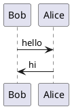

# PlantUML Markdown Preview Plugin

An IntelliJ IDEA plugin that renders PlantUML code blocks as UML diagrams in Markdown preview.

## Features

- 🎨 Renders PlantUML diagrams directly in Markdown preview
- 🚀 No Graphviz installation required (uses built-in Smetana layout engine)
- 📝 Supports `plantuml` and `puml` fenced code blocks
- ⚡ Real-time preview updates

## Installation

### From JetBrains Marketplace

1. Open IntelliJ IDEA
2. Go to `Settings → Plugins → Marketplace`
3. Search for "PlantUML Markdown Preview"
4. Click `Install`

### From Release

1. Download the latest `plant-uml-plugin-*.zip` from [Releases](https://github.com/lchrennew/plantuml-markdown-plugin/releases)
2. Open IntelliJ IDEA
3. Go to `Settings → Plugins → ⚙️ → Install Plugin from Disk...`
4. Select the downloaded zip file

## Usage

Simply write PlantUML code in a fenced code block in your Markdown file:

````markdown

````

Or use the shorthand syntax (without `@startuml`/`@enduml`):

````markdown
```plantuml
Bob -> Alice : hello
Alice -> Bob : hi
```
````

The diagram will be rendered automatically in the Markdown preview panel.

## Supported Diagram Types

- Sequence diagrams
- Use case diagrams
- Class diagrams
- Activity diagrams
- Component diagrams
- State diagrams
- Object diagrams
- Deployment diagrams
- Timing diagrams
- And more...

## Build from Source

### Prerequisites

- JDK 17 or higher
- Maven 3.6+
- IntelliJ IDEA installed at `/Applications/IntelliJ IDEA.app/Contents` (macOS)

### Build Steps

```bash
git clone https://github.com/lchrennew/plantuml-markdown-plugin.git
cd plantuml-markdown-plugin
mvn clean package
```

The plugin zip will be generated at `target/plant-uml-plugin-1.0.1-plugin.zip`.

## Configuration

No configuration needed! The plugin works out of the box.

## Compatibility

- **IntelliJ IDEA**: 2024.1 - 2025.1.*
- **Requires**: Markdown plugin (bundled with IntelliJ IDEA)

## License

This project is licensed under the Apache License 2.0 - see the [LICENSE](LICENSE) file for details.

## Author

**Chun Li**
- Email: lchrennew@126.com
- GitHub: [@lchrennew](https://github.com/lchrennew)

## Acknowledgments

- [PlantUML](https://plantuml.com/) - The amazing UML diagram tool
- [IntelliJ Platform SDK](https://plugins.jetbrains.com/docs/intellij/) - Plugin development framework

## Contributing

Contributions are welcome! Please feel free to submit a Pull Request.

## Support

If you encounter any issues or have suggestions, please [open an issue](https://github.com/lchrennew/plantuml-markdown-plugin/issues).
